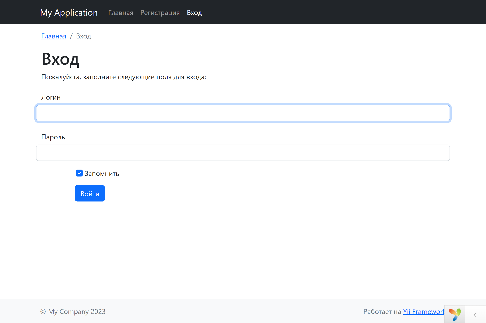
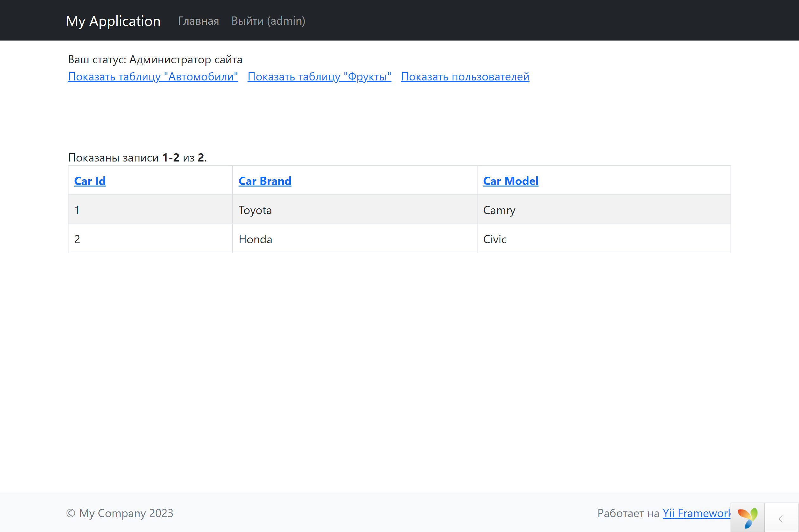
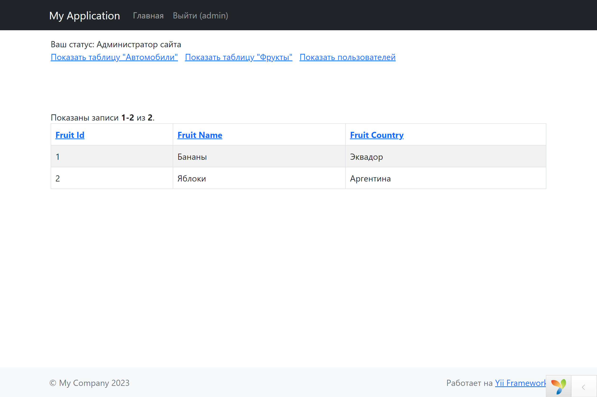
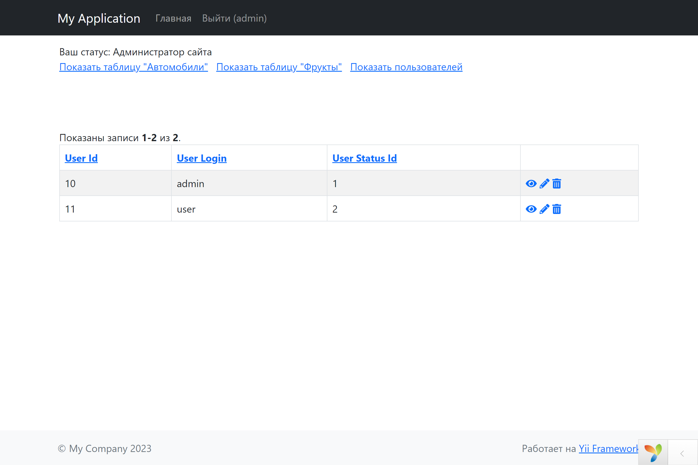
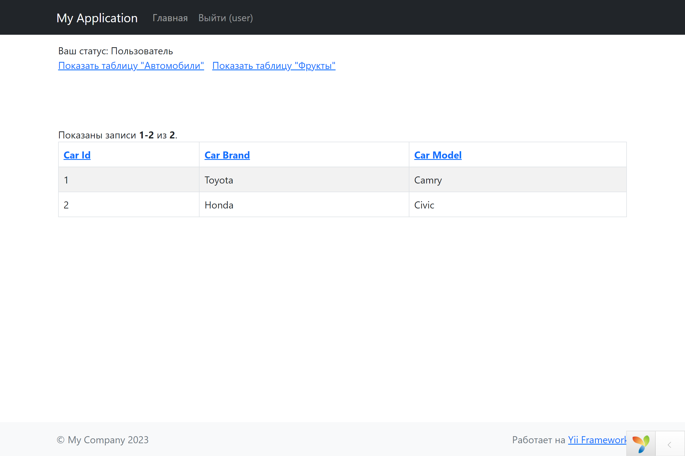

# Authorization form (PHP-Yii2)
Стек: PHP, Yii2, MySQL.

Мини-приложение с базой данных и формой авторизации на Yii2 c валидацией, регистрацией, базой данных MySQL, разделением прав пользователей и шифрованием паролей.

Что делает приложение:
- при авторизации выводит навигационную панель с кнопками, по нажатию на которые
выводятся данные из созданных таблиц в БД.
- если пользователь авторизован как Админ, то выводит дополнительно в навигационную
панель таблицу с пользователями.
  

### Интерфейс приложения.

Вход:

Навигационная панель для админа с таблицей "Автомобили":

Навигационная панель для админа с таблицей "Фрукты":

Навигационная панель для админа с таблицей "Пользователи":

Навигационная панель для пользователя с таблицей "Автомобили":

 
Комментарии к запуску:

> Дамп БД находится в папке "_downloads". 

> Редактирование данных ещё не добавлено, несмотря на наличие столбца с кнопками редактирования.